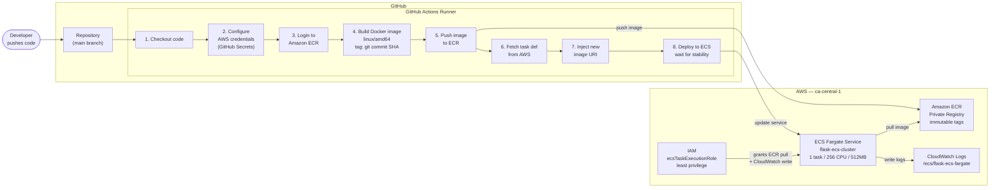
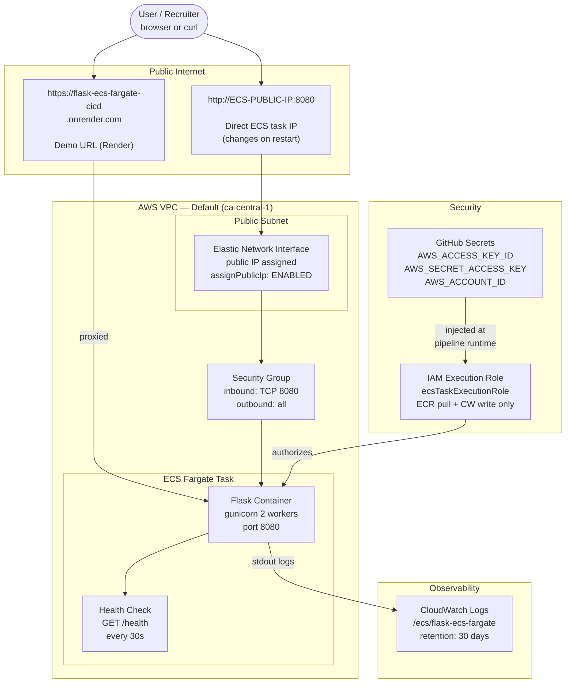

# Architecture: Flask ECS Fargate CI/CD Pipeline

GitHub renders this Mermaid diagram natively. It shows two views:
1. **CI/CD pipeline flow** — what happens on every git push
2. **AWS runtime architecture** — how traffic flows to the running app

---

## CI/CD Pipeline — triggered on every push to main

---

## AWS Runtime Architecture — how traffic reaches the app

---

## Pipeline execution times (real measured values)

| Step | Time |
|---|---|
| Checkout + configure credentials | ~10s |
| ECR login | ~5s |
| Docker build (linux/amd64, cached layers) | ~45s |
| Push to ECR | ~20s |
| Fetch + render task definition | ~5s |
| ECS deploy + stabilization wait | ~60s |
| **Total pipeline duration** | **~2.5 minutes** |

---

## Security design decisions

| Decision | Reason |
|---|---|
| AWS credentials in GitHub Secrets | Never stored in code or config files |
| Account ID injected via `sed` at runtime | No account ID committed to repo |
| Task definition fetched live from AWS | No stale config in repo, no drift |
| IAM role: least privilege | Only ECR pull + CloudWatch write — nothing else |
| `linux/amd64` build platform | ECS Fargate requires AMD64 — not ARM64 (Apple Silicon) |
| Commit SHA as image tag | Every deployment traceable to exact commit — rollback = redeploy SHA |

---

*Architecture sourced from:*
- *[AWS Blog: CI/CD pipeline for Amazon ECS with GitHub Actions](https://aws.amazon.com/blogs/containers/create-a-ci-cd-pipeline-for-amazon-ecs-with-github-actions-and-aws-codebuild-tests/)*
- *[AWS Blog: Automated deployments with GitHub Actions for Amazon ECS](https://aws.amazon.com/blogs/containers/automated-deployments-with-github-actions-for-amazon-ecs-express-mode/)*
- *AWS ECS Fargate official documentation*
