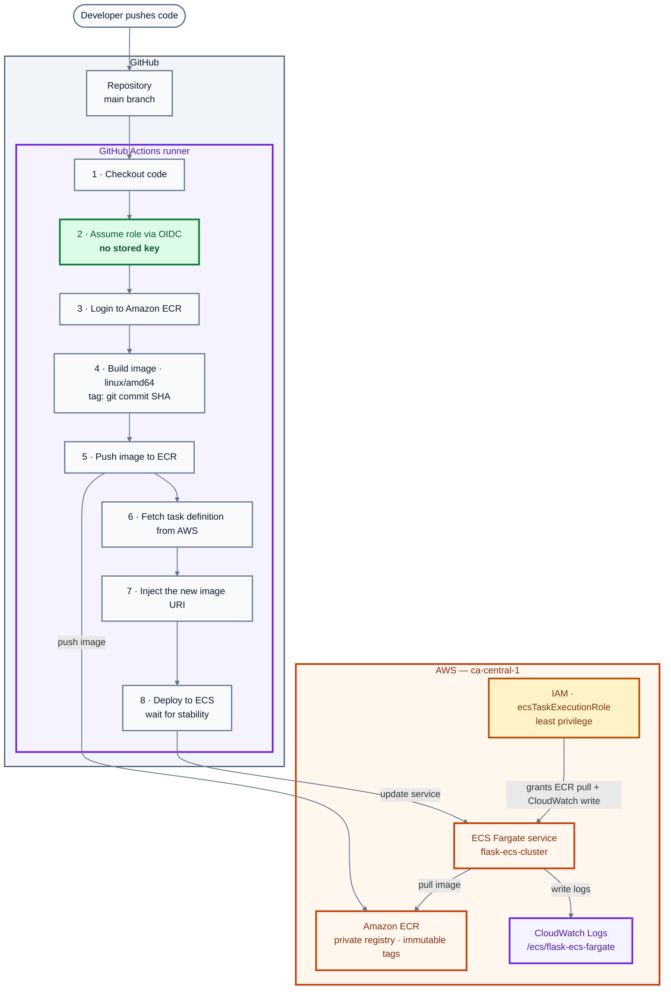
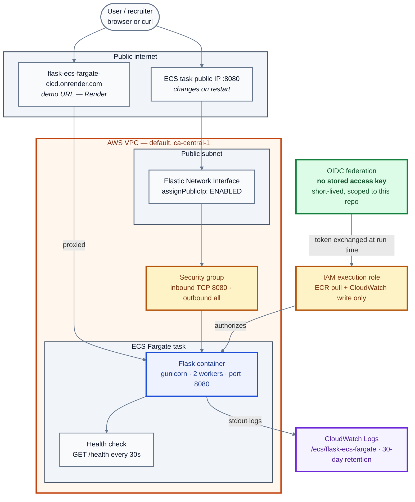

# Architecture: Flask ECS Fargate CI/CD Pipeline

GitHub renders this Mermaid diagram natively. It shows two views:
1. **Release pipeline flow** — what happens when a deploy is run
2. **AWS runtime architecture** — how traffic flows to the running app

> **Triggers.** `ci.yml` runs on **every push and pull request** — install, test, build.
> The release pipeline below is `deploy.yml`, which is **manual**
> (`workflow_dispatch`), because it targets a live ECS cluster and a public repository
> should not go red the day the AWS account is torn down.

---

## Release Pipeline — run manually from the Actions tab

```mermaid
flowchart TD
  Dev(["Developer pushes code"])

  subgraph GitHub["GitHub"]
    Repo["Repository<br/>main branch"]
    subgraph Actions["GitHub Actions runner"]
      direction TB
      Step1["1 · Checkout code"]
      Step2["2 · Assume role via OIDC<br/><b>no stored key</b>"]
      Step3["3 · Login to Amazon ECR"]
      Step4["4 · Build image · linux/amd64<br/>tag: git commit SHA"]
      Step5["5 · Push image to ECR"]
      Step6["6 · Fetch task definition from AWS"]
      Step7["7 · Inject the new image URI"]
      Step8["8 · Deploy to ECS<br/>wait for stability"]
      Step1 --> Step2 --> Step3 --> Step4 --> Step5 --> Step6 --> Step7 --> Step8
    end
  end

  subgraph AWS["AWS — ca-central-1"]
    ECR["Amazon ECR<br/>private registry · immutable tags"]
    ECS["ECS Fargate service<br/>flask-ecs-cluster"]
    CW["CloudWatch Logs<br/>/ecs/flask-ecs-fargate"]
    IAM["IAM · ecsTaskExecutionRole<br/>least privilege"]
  end

  Dev --> Repo --> Step1
  Step5 -->|"push image"| ECR
  Step8 -->|"update service"| ECS
  ECS -->|"pull image"| ECR
  ECS -->|"write logs"| CW
  IAM -->|"grants ECR pull + CloudWatch write"| ECS

    linkStyle default stroke:#64748b,stroke-width:1.5px
    classDef default fill:#f8fafc,stroke:#64748b,stroke-width:2px,color:#0f172a
    classDef aws   fill:#fff7ed,stroke:#c2410c,stroke-width:3px,color:#7c2d12
    classDef ci    fill:#f5f3ff,stroke:#6d28d9,stroke-width:3px,color:#4c1d95
    classDef ok    fill:#dcfce7,stroke:#15803d,stroke-width:3px,color:#14532d
    classDef warn  fill:#fef3c7,stroke:#b45309,stroke-width:3px,color:#78350f
    class Step2 ok
    class ECR,ECS aws
    class CW ci
    class IAM warn
    style GitHub fill:#f1f5f9,stroke:#475569,stroke-width:2px,color:#0f172a
    style Actions fill:#f5f3ff,stroke:#6d28d9,stroke-width:3px,color:#4c1d95
    style AWS fill:#fff7ed,stroke:#c2410c,stroke-width:3px,color:#7c2d12
```

---

## AWS Runtime Architecture — how traffic reaches the app

```mermaid
flowchart TB
  User(["User / recruiter<br/>browser or curl"])

  subgraph Internet["Public internet"]
    URL["flask-ecs-fargate-cicd.onrender.com<br/><i>demo URL — Render</i>"]
    AWSIP["ECS task public IP :8080<br/><i>changes on restart</i>"]
  end

  subgraph VPC["AWS VPC — default, ca-central-1"]
    subgraph PublicSubnet["Public subnet"]
      ENI["Elastic Network Interface<br/>assignPublicIp: ENABLED"]
    end
    subgraph ECSFargate["ECS Fargate task"]
      Container["Flask container<br/>gunicorn · 2 workers · port 8080"]
      Health["Health check<br/>GET /health every 30s"]
    end
    SG["Security group<br/>inbound TCP 8080 · outbound all"]
  end

  CW["CloudWatch Logs<br/>/ecs/flask-ecs-fargate · 30-day retention"]
  IAM["IAM execution role<br/>ECR pull + CloudWatch write only"]
  OIDC["OIDC federation<br/><b>no stored access key</b><br/>short-lived, scoped to this repo"]

  User --> URL
  User --> AWSIP
  URL -->|"proxied"| Container
  AWSIP --> ENI --> SG --> Container
  Container --> Health
  Container -->|"stdout logs"| CW
  IAM -->|"authorizes"| Container
  OIDC -->|"token exchanged at run time"| IAM

    linkStyle default stroke:#64748b,stroke-width:1.5px
    classDef default fill:#f8fafc,stroke:#64748b,stroke-width:2px,color:#0f172a
    classDef ci    fill:#f5f3ff,stroke:#6d28d9,stroke-width:3px,color:#4c1d95
    classDef k8s   fill:#eef2ff,stroke:#1d4ed8,stroke-width:3px,color:#1e3a8a
    classDef ok    fill:#dcfce7,stroke:#15803d,stroke-width:3px,color:#14532d
    classDef warn  fill:#fef3c7,stroke:#b45309,stroke-width:3px,color:#78350f
    class Container k8s
    class SG,IAM warn
    class OIDC ok
    class CW ci
    style Internet fill:#f1f5f9,stroke:#475569,stroke-width:2px,color:#0f172a
    style VPC fill:#fff7ed,stroke:#c2410c,stroke-width:3px,color:#7c2d12
    style PublicSubnet fill:#f1f5f9,stroke:#475569,stroke-width:2px,color:#0f172a
    style ECSFargate fill:#f1f5f9,stroke:#475569,stroke-width:2px,color:#0f172a
```

---

## Pipeline execution times (real measured values)

| Step | Time |
|---|---|
| Checkout + configure credentials | ~10s |
| ECR login | ~5s |
| Docker build (linux/amd64, cached layers) | ~45s |
| Push to ECR | ~20s |
| Fetch + render task definition | ~5s |
| ECS deploy + stabilization wait | ~60s |
| **Total pipeline duration** | **~2.5 minutes** |

---

## Security design decisions

| Decision | Reason |
|---|---|
| OIDC federation, no stored access key | Nothing to leak, nothing to rotate; trust scoped to this repository |
| Account ID resolved from the ECR login output at runtime | No account ID committed to repo |
| Task definition fetched live from AWS | No stale config in repo, no drift |
| IAM role: least privilege | Only ECR pull + CloudWatch write — nothing else |
| `linux/amd64` build platform | ECS Fargate requires AMD64 — not ARM64 (Apple Silicon) |
| Commit SHA as image tag | Every deployment traceable to exact commit — rollback = redeploy SHA |

---

*Architecture sourced from:*
- *[AWS Blog: CI/CD pipeline for Amazon ECS with GitHub Actions](https://aws.amazon.com/blogs/containers/create-a-ci-cd-pipeline-for-amazon-ecs-with-github-actions-and-aws-codebuild-tests/)*
- *[AWS Blog: Automated deployments with GitHub Actions for Amazon ECS](https://aws.amazon.com/blogs/containers/automated-deployments-with-github-actions-for-amazon-ecs-express-mode/)*
- *AWS ECS Fargate official documentation*
